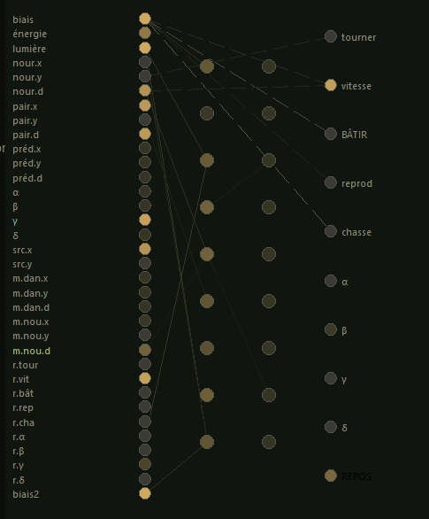

The Neural Network of Microcosme

    Not a trained model — a living species.Every sapien in Microcosme carries its own neural network, ~600 floating-pointweights, inherited, mutated, and selected by nothing but survival.

Observatory — the network, live
1. Architecture

34 inputs → 9 → 9 → 10 outputs

and it is enough: every connection carries a weight (its strength) that makes
**all** the character. About 600 weights per sapien.

### The 34 inputs, in order

| Range | Meaning |
|---|---|
| 0–2   | bias · energy (0=hungry, 1=full) · daylight |
| 3–5   | nearest food: direction X, Y, closeness |
| 6–8   | nearest peer: X, Y, closeness |
| 9–11  | nearest predator: X, Y, closeness |
| 12–15 | the four calls heard: α, β, γ, δ (signal strength) |
| 16–17 | direction the loudest call comes from |
| 18–20 | nearest danger memory: X, Y, strength |
| 21–23 | food memory: X, Y, strength (weighted by hunger) |
| 24–32 | the **nine echoes**: what the network itself decided last thought |
| 33    | constant bias = 1 |

Directions are relative to the body's heading: *"to my left front"*,
not *"north-west of the island"*.

### The 10 outputs

`0 turn · 1 advance · 2 build · 3 breed · 4 hunt · 5–8 call α β γ δ · 9 rest`

The most active output wins and becomes the current action.

## 2. Three paths in one network

- **Slow path** — inputs → 9 → 9 → outputs: the reflection;
- **Direct path** — inputs → outputs, skipping the hidden layers: the reflexes
  (drawn dashed on screen);
- **Recurrences** — yesterday's outputs feed today's inputs (the nine echoes).
  This is what gives sustained behavior: a sapien that flees **keeps** fleeing,
  a caller keeps calling.

## 3. Not trained — evolved

| Classical deep learning | Microcosme |
|---|---|
| Backpropagation: error measured, weights corrected | **No correction, ever.** It is born with its weights and mostly dies with them |
| One network, millions of labeled examples | A **population**, each member living one life |
| Objective: minimize a loss function | No objective: survive and breed — selection does the sorting |
| Weights = optimized parameters | Weights = **mental DNA** |
| Training offline, then deployed frozen | Indissociable: the network acts in real time, and its decisions decide its survival |

## 4. The three forces that shape it

### 1. Inheritance
At birth, the child copies a parent's network — then mutation runs:
~13 % of weights drift slightly, ~2 % jump elsewhere outright. And the
**voice** (the α β γ δ weights) mutates twice as much — by design: language
must vary faster than the body. Each lineage carries its own mutation rate,
inherited and itself mutable: "innovative" and "conservative" families coexist,
and selection arbitrates.

### 2. Mentorship (culture)
The child picks the wisest neighbor as mentor. Its network slowly glides
toward the mentor's — but **never beyond 30 % of the genetic distance**.
DNA is never overwritten, only guided. This is a Lamarckian learning layer
sitting on a Darwinian transmission: what is learned in one life is not
passed to children, but it changes who survives.

The actual code, from the simulation:

// — transmission culturelle + apprentissage autonome —
if (C.Mentor <> nil) and (C.Cult < 0.95) then begin
  ...
  C.Cult := Min(0.95, C.Cult + Gain);
  // the network drifts toward the mentor WITHOUT erasing the DNA:
  // at most 30 % of the genetic distance can be bridged
  for I := 0 to NW - 1 do begin
    Tgt := C.Dna[I] + (C.Mentor.Net[I] - C.Dna[I]) * 0.30;
    C.Net[I] := C.Net[I] + (Tgt - C.Net[I]) * (0.15 * DT);
  end;
  ...
end;
 
 
3. Selection

Those who find food, dodge wolves, avoid drowning… live longer and breed
more. Their weights spread. Natural selection, with no other judge than
survival. No error feedback, no reward, no goal — the network never
"knows" it was wrong. The lesson is learned across generations, not within
one life.
5. The Baldwin effect, live

Mentorship is not inherited — yet it changes who survives, and therefore
accelerates the evolution of the genes themselves. Microcosme makes this
measurable: three natural switches in the code — mentorship on/off, voice
mutation boost on/off, direct path on/off — turn the project into a small
evolution laboratory.
6. Where it stands

Microcosme belongs to the neuroevolution family — see NEAT
(Stanley & Miikkulainen) and the famous MarI/O experiment. What
distinguishes it:

     the networks live in a persistent world (seasons, predators, famines,
    a people's memory), not in an ephemeral task;
     the cultural layer (mentorship capped by genetic distance) bridging
    Lamarck and Darwin;
     an emergent language whose outputs mutate faster than the body, and
    whose meaning is fixed by no one — the notebook only guesses it.

After 30–40 generations, the notebook curves tell the story: speed and sight
rise if predators press, culture saws up and down (an invention lost,
relearned at camp), words appear and vanish. History writes itself.